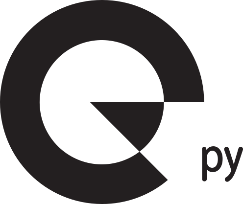

#  cellpy-connectors

Pluggable connectors for [cellpy](https://github.com/jepegit/cellpy).

This repo currently ships a **test connector**: a tiny Typer group mounted on
the cellpy CLI so the `cellpy.cli_plugins` hook can be exercised. No network,
no credentials, no BatBase. Real connector work (shared base, `configure`,
BatBase) is tracked in issues #3, #1, and #2 — those will extend this same
`connectors` group.

## Install next to cellpy

From a checkout next to `cellpy`:

```bash
cd cellpy-connectors
uv sync
# optional: live mount tests need a cellpy that includes #1058 / #1059
uv pip install -e ../cellpy
```

Or install this package into cellpy's environment:

```bash
cd cellpy
uv pip install -e ../cellpy-connectors
```

Do not commit a `[tool.uv.sources]` path override.

## Ping

With both packages installed:

```bash
uv run cellpy connectors ping
```

Prints `cellpy-connectors: ok` and exits 0. `cellpy --help` lists `connectors`
without importing this package.

## Tests

```bash
uv sync
uv run pytest
```

Tests that invoke the live `cellpy` CLI skip if cellpy is missing or predates
the plugin mount.

## Python

3.13+. Day-to-day toolchain is **uv** (`uv sync`, `uv run pytest`).
